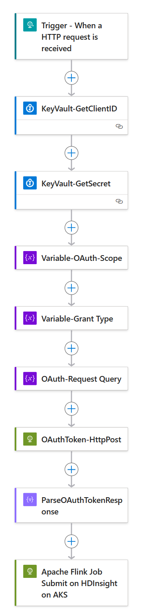

## Orchestrate Apache Flink Job on HDInsight on AKS Using Azure Logic App

You can copy the sample workflow definition from [here](flink_example_workflow.json). The sample workflow to submit Apache Flink job on HDinsight on AKS:



The input payload to trigger the workflow schema will be as following:

```
{
    "properties": {
        "cluster_resource_group": {
            "type": "string"
        },
        "flink_job_payload": {
            "properties": {},
            "type": "object"
        },
        "hdinsight_pool_name": {
            "type": "string"
        },
        "hdinsightcluster_name": {
            "type": "string"
        },
        "subscriptionId": {
            "type": "string"
        },
        "tenantId": {
            "type": "string"
        }
    },
    "type": "object"
}
```

The sample payload is as following:
```
{
  "tenantId":"<<tenantId>>",
  "subscriptionId": "<<subscriptionid>>",
  "cluster_resource_group": "<<resource group>>",
  "hdinsight_pool_name": "<<hdinsight pool name>>",
  "hdinsightcluster_name": "<<hdinsight cluster name>>",
  "flink_job_payload": {
    "properties": {
      "jobType": "FlinkJob",
      "jobName": "<<unique jobname>>",
      "action": "NEW",
      "jobJarDirectory": "abfs://<<container>>@<<storage account>>.dfs.core.windows.net",
      "jarName": "WordCount.jar",
      "entryClass": "org.apache.flink.examples.java.wordcount.WordCount",
      "args": "--input /opt/flink/LICENSE --output /tmp/run1",
      "flinkConfiguration": {
        "parallelism": "2"
      }
    }
  }
}
```
