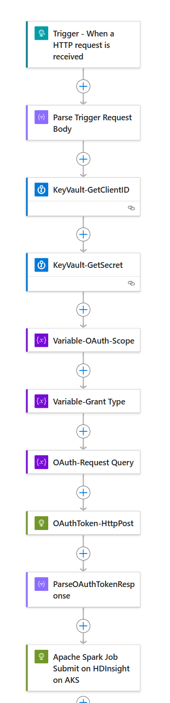

## Orchestrate Apache Spark Job on HDInsight on AKS Using Azure Logic App

You can copy the sample workflow definition from [here](spark_example_workflow_definition.json). The sample workflow to submit Apache Spark job on HDinsight on AKS:



The input payload to trigger the workflow schema will be as following:
```
{
    "type": "object",
    "properties": {
        "cluster_fqdn_name": {
            "type": "string"
        },
       "tenantId": {
            "type": "string"
        },
        "spark_submit_payload": {
            "type": "object",
            "properties": {}
        }
    }
}
```
The sample payload is as following:

```
{
  "cluster_fqdn_name":"<<cluster dns>>.hdinsightaks.net",
  "tenantId":"<<tenantId>>",
  "spark_submit_payload":{
	"className": "org.apache.spark.examples.SparkPi",
        "args": [10],
	  "name": "testjob",
	  "file": "abfs://<<container>>@<<storage account>>.dfs.core.windows.net/spark-examples_2.12-3.3.3.jar"
   }
}
```

